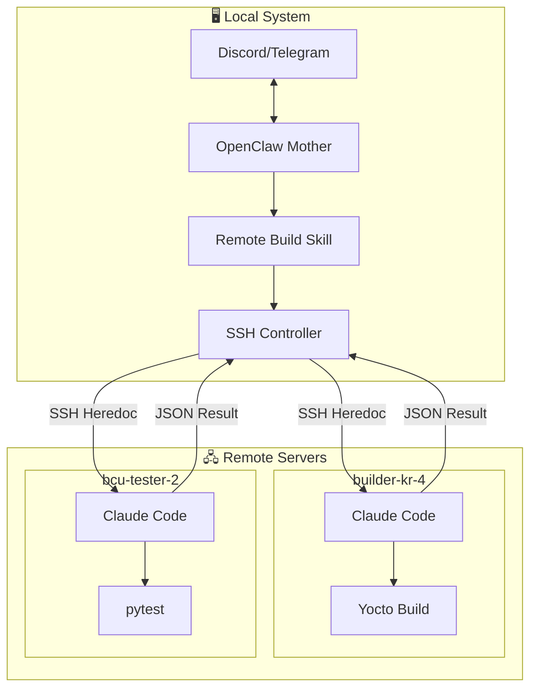
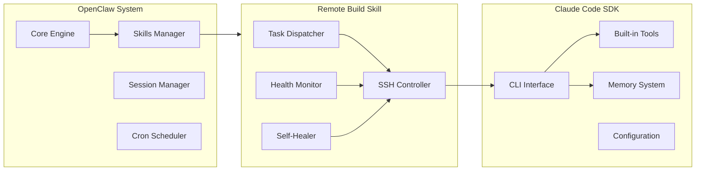
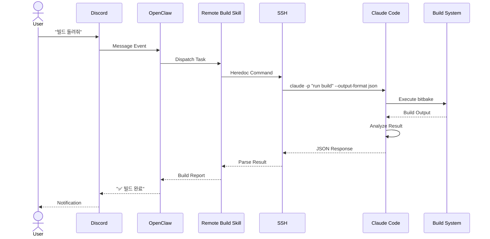
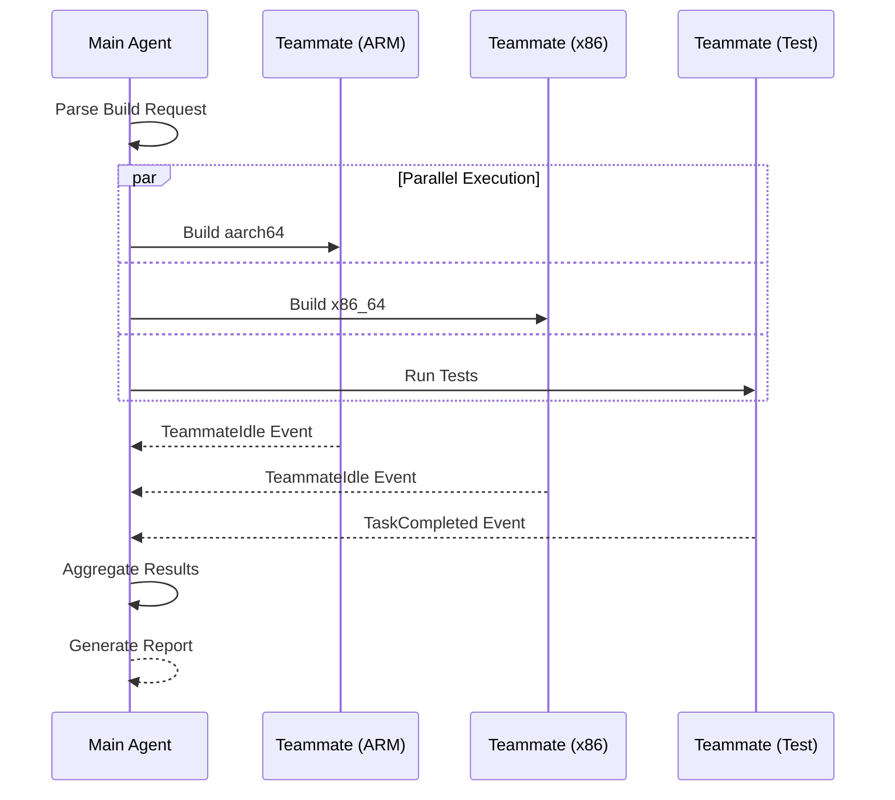
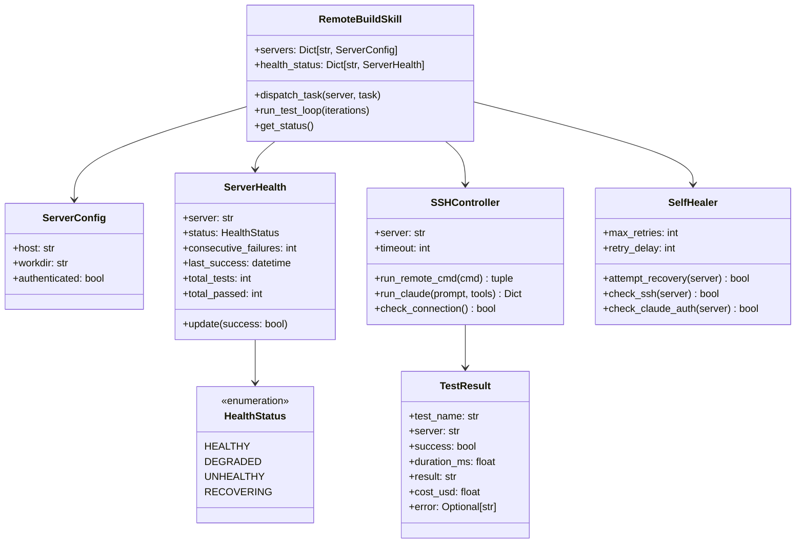
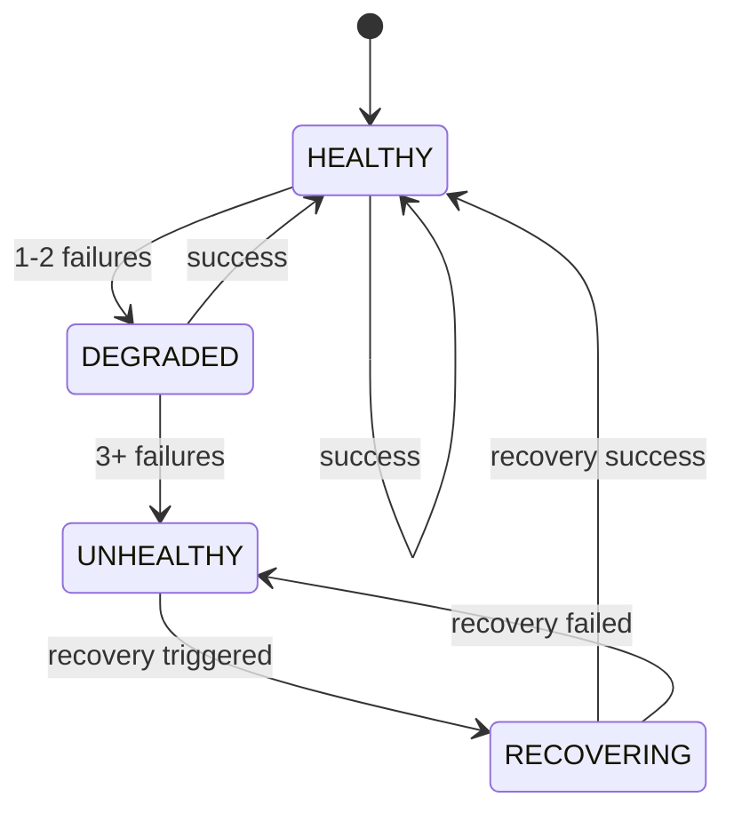
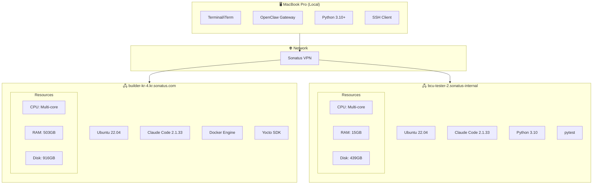
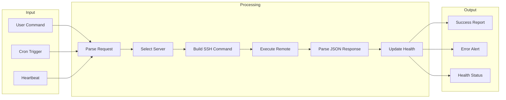
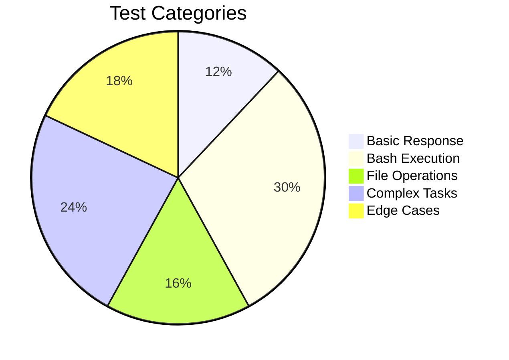

# Remote Build Architecture with Claude Code SDK

> 원격 빌드 서버에서 Claude Code SDK를 활용한 AI 기반 빌드/테스트 자동화 시스템

**Version**: 1.0  
**Created**: 2026-02-06  
**Author**: Jay Lee + Mother (OpenClaw)

---

## 📋 목차

1. [개요](#1-개요)
2. [시스템 아키텍처](#2-시스템-아키텍처)
3. [컴포넌트 다이어그램](#3-컴포넌트-다이어그램)
4. [시퀀스 다이어그램](#4-시퀀스-다이어그램)
5. [클래스 다이어그램](#5-클래스-다이어그램)
6. [배포 다이어그램](#6-배포-다이어그램)
7. [데이터 플로우](#7-데이터-플로우)
8. [API 명세](#8-api-명세)
9. [검증 결과](#9-검증-결과)

---

## 1. 개요

### 1.1 목적

원격 빌드 서버(Yocto, Host Build, Test Runner)에서 Claude Code를 SDK로 활용하여:
- 빌드 자동화 및 오류 분석
- 테스트 실행 및 결과 분석
- 자가 복구(Self-Healing) 기능

### 1.2 핵심 기술

| 기술 | 버전 | 용도 |
|------|------|------|
| Claude Code | v2.1.33 | AI 에이전트 (SDK) |
| SSH | OpenSSH | 원격 접속 |
| Python | 3.10+ | 컨트롤러 |
| OpenClaw | Latest | 오케스트레이션 |

### 1.3 지원 서버

| 서버 | 용도 | 인증 상태 |
|------|------|----------|
| builder-kr-4 | Yocto 빌드 | ✅ 완료 |
| bcu-tester-2 | 통합 테스트 | ⚠️ 필요 |

---

## 2. 시스템 아키텍처

### 2.1 전체 구조 (ASCII)

```
┌─────────────────────────────────────────────────────────────────────────────┐
│                              LOCAL SYSTEM                                   │
│                           (MacBook / OpenClaw)                              │
├─────────────────────────────────────────────────────────────────────────────┤
│                                                                             │
│   ┌─────────────┐    ┌─────────────────────────────────────────────────┐   │
│   │   Discord   │    │              OpenClaw (Mother)                   │   │
│   │   Telegram  │◄──►│  ┌─────────────────────────────────────────┐    │   │
│   │   (Chat)    │    │  │          Remote Build Skill             │    │   │
│   └─────────────┘    │  │  ┌─────────────┐  ┌─────────────────┐   │    │   │
│                      │  │  │   Task      │  │  Self-Healing   │   │    │   │
│                      │  │  │  Dispatcher │  │     Loop        │   │    │   │
│                      │  │  └──────┬──────┘  └────────┬────────┘   │    │   │
│                      │  │         │                  │            │    │   │
│                      │  │         └────────┬─────────┘            │    │   │
│                      │  │                  │                      │    │   │
│                      │  │         ┌────────▼────────┐             │    │   │
│                      │  │         │  SSH Controller │             │    │   │
│                      │  │         │   (Heredoc)     │             │    │   │
│                      │  │         └────────┬────────┘             │    │   │
│                      │  └──────────────────┼──────────────────────┘    │   │
│                      └─────────────────────┼───────────────────────────┘   │
│                                            │                               │
└────────────────────────────────────────────┼───────────────────────────────┘
                                             │
                                             │ SSH (Port 22)
                                             │ Heredoc Command
                                             │
┌────────────────────────────────────────────┼───────────────────────────────┐
│                              REMOTE SERVERS                                │
├────────────────────────────────────────────┼───────────────────────────────┤
│                                            │                               │
│     ┌──────────────────────────────────────┼─────────────────────────┐     │
│     │                                      ▼                         │     │
│     │  ┌─────────────────────────────────────────────────────────┐  │     │
│     │  │                    Claude Code v2.1.33                   │  │     │
│     │  │                                                          │  │     │
│     │  │  ┌─────────┐ ┌─────────┐ ┌─────────┐ ┌─────────────────┐│  │     │
│     │  │  │  Bash   │ │  Read   │ │  Edit   │ │  Other Tools    ││  │     │
│     │  │  └─────────┘ └─────────┘ └─────────┘ └─────────────────┘│  │     │
│     │  │                                                          │  │     │
│     │  │  ┌──────────────────────────────────────────────────────┐│  │     │
│     │  │  │  claude -p "task" --output-format json               ││  │     │
│     │  │  │                  --allowedTools "Bash,Read"          ││  │     │
│     │  │  │                  --dangerously-skip-permissions      ││  │     │
│     │  │  └──────────────────────────────────────────────────────┘│  │     │
│     │  └──────────────────────────────────────────────────────────┘  │     │
│     │                                                                │     │
│     │  ┌──────────────────┐  ┌──────────────────┐                   │     │
│     │  │ ~/.claude/       │  │ Project/         │                   │     │
│     │  │ ├─ credentials   │  │ ├─ .claude/      │                   │     │
│     │  │ ├─ settings      │  │ │  ├─ CLAUDE.md  │                   │     │
│     │  │ └─ memory/       │  │ │  └─ agents/    │                   │     │
│     │  └──────────────────┘  │ └─ source code   │                   │     │
│     │                        └──────────────────┘                   │     │
│     │                                                                │     │
│     │  ┌────────────────────────────────────────────────────────┐   │     │
│     │  │                    Build/Test Environment              │   │     │
│     │  │  • Docker containers                                   │   │     │
│     │  │  • Yocto SDK                                          │   │     │
│     │  │  • pytest, integration tests                          │   │     │
│     │  └────────────────────────────────────────────────────────┘   │     │
│     │                                                                │     │
│     └────────────────────────────────────────────────────────────────┘     │
│              builder-kr-4                    bcu-tester-2                  │
└─────────────────────────────────────────────────────────────────────────────┘
```

### 2.2 Mermaid 아키텍처 다이어그램



---

## 3. 컴포넌트 다이어그램

### 3.1 UML Component Diagram (Mermaid)



### 3.2 컴포넌트 상세

| 컴포넌트 | 책임 | 인터페이스 |
|----------|------|-----------|
| **Task Dispatcher** | 작업 분배 및 라우팅 | `dispatch(server, task)` |
| **Health Monitor** | 서버 상태 모니터링 | `check_health(server)` |
| **Self-Healer** | 장애 복구 | `attempt_recovery(server)` |
| **SSH Controller** | SSH 통신 관리 | `run_remote_cmd(cmd)` |
| **Claude Code CLI** | AI 에이전트 실행 | `claude -p "task"` |

---

## 4. 시퀀스 다이어그램

### 4.1 기본 빌드 요청 플로우



### 4.2 자가 복구 플로우

```mermaid
sequenceDiagram
    participant Loop as Self-Healing Loop
    participant Health as Health Monitor
    participant SSH
    participant CC as Claude Code
    participant Recovery as Self-Healer
    
    Loop->>Health: Check Server Status
    Health->>SSH: Test Connection
    
    alt SSH Failed
        SSH-->>Health: Connection Error
        Health->>Loop: Status: UNHEALTHY
        Loop->>Recovery: Attempt Recovery
        
        Recovery->>SSH: Reconnect
        SSH-->>Recovery: OK
        Recovery->>CC: Check Version
        CC-->>Recovery: v2.1.33
        Recovery->>CC: Check Auth
        CC-->>Recovery: Authenticated
        
        Recovery-->>Loop: Recovery Success
        Loop->>Loop: Continue Tests
    else SSH Success
        SSH-->>Health: OK
        Health->>CC: Run Test
        CC-->>Health: Result
        Health->>Loop: Update Health Status
    end
```

### 4.3 병렬 빌드 (Agent Teams)



---

## 5. 클래스 다이어그램

### 5.1 Python 모듈 구조



### 5.2 상태 머신 (Server Health)



---

## 6. 배포 다이어그램

### 6.1 물리 배포 구조



### 6.2 설치 요구사항

```bash
# Local (MacBook)
brew install openssh
npm install -g openclaw

# Remote (Builder/Tester)
curl -fsSL https://claude.ai/install.sh | bash
echo 'export PATH="$HOME/.local/bin:$PATH"' >> ~/.bashrc

# Authentication (한번만)
claude login  # OAuth 인증
```

---

## 7. 데이터 플로우

### 7.1 요청/응답 흐름



### 7.2 데이터 구조

#### Request (SSH Heredoc)
```bash
ssh builder-kr-4 'bash -s' << 'EOF'
export PATH="/usr/bin:$HOME/.local/bin:$PATH"
cd /home/jay.lee
/usr/bin/timeout 45 $HOME/.local/bin/claude \
  -p "Run yocto build for aarch64" \
  --allowedTools 'Bash,Read' \
  --output-format json \
  --dangerously-skip-permissions 2>&1
EOF
```

#### Response (JSON)
```json
{
  "type": "result",
  "subtype": "success",
  "is_error": false,
  "duration_ms": 8541,
  "result": "Build completed successfully...",
  "session_id": "uuid-here",
  "total_cost_usd": 0.0272,
  "usage": {
    "input_tokens": 3,
    "cache_read_input_tokens": 18389,
    "output_tokens": 45
  },
  "modelUsage": {
    "claude-opus-4-6": {
      "inputTokens": 3,
      "outputTokens": 45,
      "costUSD": 0.0272
    }
  }
}
```

---

## 8. API 명세

### 8.1 Claude Code CLI

```bash
claude -p "<prompt>" [options]

Options:
  --allowedTools <tools>    # Bash,Read,Edit,Write,Grep,Glob
  --output-format <format>  # text, json, stream-json
  --dangerously-skip-permissions  # 권한 확인 생략
  --model <model>           # claude-opus-4-6, claude-sonnet-4-5
  --timeout <seconds>       # 타임아웃 설정
  --continue                # 이전 세션 계속
  --resume <session-id>     # 특정 세션 재개
```

### 8.2 Python Interface

```python
class RemoteBuildSkill:
    def dispatch_task(
        self,
        server: str,
        task: str,
        tools: str = "Bash,Read",
        timeout: int = 60
    ) -> TestResult:
        """원격 서버에서 Claude 태스크 실행"""
        ...
    
    def run_test_loop(
        self,
        iterations: int = 50,
        status_interval: int = 10
    ) -> Dict[str, Any]:
        """자가 힐링 테스트 루프 실행"""
        ...
    
    def get_health(self, server: str) -> ServerHealth:
        """서버 헬스 상태 조회"""
        ...
```

---

## 9. 검증 결과

### 9.1 테스트 결과 (2026-02-06)

| Metric | Value |
|--------|-------|
| **Total Tests** | 50 |
| **Passed** | 50 (100%) |
| **Duration** | 8.1 min |
| **Total Cost** | $1.16 |
| **Avg Cost/Test** | $0.023 |
| **Avg Response** | 8-10s |

### 9.2 테스트 카테고리별 결과



### 9.3 성능 특성

| Operation | Avg Time | Cost |
|-----------|----------|------|
| Simple prompt | 5-6s | $0.015 |
| Bash command | 8-10s | $0.027 |
| File operation | 9-12s | $0.030 |
| Complex analysis | 10-15s | $0.040 |

### 9.4 안정성

- **연속 50회 테스트**: 100% 성공률
- **자가 복구**: 3회 연속 실패 시 자동 트리거
- **복구 단계**: SSH → Claude 설치 → 인증 확인

---

## 📁 관련 파일

| 파일 | 설명 |
|------|------|
| `skills/remote-build/SKILL.md` | 스킬 정의 |
| `skills/remote-build/scripts/comprehensive_test.py` | 종합 테스트 |
| `skills/remote-build/scripts/self_healing_loop.py` | 자가 힐링 루프 |
| `CLAUDE_CODE_SDK_ARCHITECTURE.md` | 간략 아키텍처 |

---

## 📚 참고자료

- [Claude Code Documentation](https://code.claude.com/docs)
- [Claude Code SDK](https://platform.claude.com/docs/en/agent-sdk/overview)
- [OpenClaw Documentation](https://docs.openclaw.ai)
- [Anthropic API Reference](https://docs.anthropic.com)

---

*Last Updated: 2026-02-06*
*Validated with Claude Code v2.1.33*
